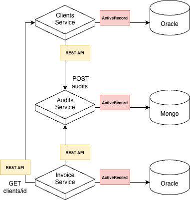

# Microservicio de Facturas - FactuMarket

Microservicio para la gestión y registro de facturas en el sistema de facturación electrónica, implementado con Ruby on Rails 7 siguiendo principios de Clean Architecture.

## 🏗️ Arquitectura

Este microservicio implementa **Clean Architecture** con las siguientes capas:

```
┌─────────────────────────────────────┐
│   Presentación (Controllers)        │  ← API REST con MVC
├─────────────────────────────────────┤
│   Aplicación (Use Cases)            │  ← Lógica de aplicación
├─────────────────────────────────────┤
│   Dominio (Entities, Validators)    │  ← Lógica de negocio
├─────────────────────────────────────┤
│   Infraestructura (Repositories)    │  ← Acceso a datos
└─────────────────────────────────────┘
```



## 📁 Estructura de Carpetas

```
app/
├── controllers/api/v1/          # Capa de Presentación (MVC)
├── use_cases/invoices/            # Capa de Aplicación
├── domain/
│   ├── entities/                # Entidades de dominio
│   ├── repositories/            # Interfaces de repositorios
│   └── validators/              # Validadores de negocio
└── infrastructure/
    ├── repositories/            # Implementaciones de repositorios
    └── http/                    # Audites HTTP
```

## 🚀 Tecnologías

- **Ruby**: 3.2.2
- **Rails**: 7.1.0
- **Base de datos**: Oracle (transaccional)
- **Comunicación**: HTTP REST (HTTParty)
- **Testing**: RSpec

## 📋 Prerequisitos

- Ruby 3.2.2
- Oracle Database (XE 21c o superior)
- Oracle Instant Audit
- Bundler
- Docker

## ⚙️ Instalación

### 1. Clonar el repositorio

```bash
git clone https://github.com/mariaabonilla11/invoices-service-app
cd audits-service-app
```

### 2. Ejecutar imagen y correr contenedor 🐳

### Construir imagen

```bash
docker build -t invoices-service-app .
```

### Ejecutar con Docker Compose

```bash
docker-compose up invoices-service-app
```

### 3. Configurar variables de entorno

```bash
Si se desea cambiar las credenciales de Oracle cambiar credenciales en docker-compose.yml y config/database.yml
```

El servicio estará disponible en `http://IPLOCAL:3002`

## Colección de Postman

Puedes importar la colección de Postman desde este archivo:
[📥 Descargar colección de Postman](./Microservices.postman_collection.json)

## 📡 API Endpoints

### Crear Invoice

```http
POST /api/v1/invoices
Content-Type: application/json

{
    "client_id": 1,
    "amount": 1003,
    "due_date": "2025-11-06T14:34:15Z"
}
```

**Respuesta exitosa (201)**:

```json
{
  "message": "Factura creada exitosamente",
  "invoice": {
    "id": 3,
    "client_id": 1,
    "amount": 1003,
    "state": "active",
    "due_date": "2025-11-06T14:34:15.000Z",
    "created_at": "2025-11-06T12:45:34.983Z",
    "updated_at": "2025-11-06T12:45:34.983Z"
  }
}
```

### Consultar Invoice por ID

```http
GET /api/v1/invoices/3
```

**Respuesta exitosa (200)**:

```json
{
  "message": "Factura encontrada exitosamente",
  "invoice": {
    "success": true,
    "data": {
      "id": 3,
      "client_id": 1,
      "amount": 1003,
      "state": "active",
      "due_date": "2025-11-06T14:34:15.000Z",
      "created_at": "2025-11-06T12:45:34.983Z",
      "updated_at": "2025-11-06T12:45:34.983Z"
    },
    "errors": []
  }
}
```

### Consultar Invoice por Rango de fecha

```http
GET /api/v1/invoices?start_date="2025-11-07T14:34:15Z"&end_date="2025-11-07T15:34:15Z"
Params start_date, end_date
```

**Respuesta exitosa (200)**:

```json
{
    "message": "Facturas filtradas exitosamente",
    "invoices": [
        {
            "id": 22,
            "client_id": 1,
            "amount": 1002,
            "state": "active",
            "due_date": "2025-11-06T14:34:15.000Z",
            "created_at": "2025-11-06T01:43:46.626Z",
            "updated_at": "2025-11-06T01:43:46.626Z"
        },
        ...
    ]
}
```

## 🧪 Testing

### Ejecutar todos los tests

```bash
bundle exec rspec
```

### Ejecutar tests específicos

```bash
# Tests de entidades
bundle exec rspec spec/domain/entities/

# Tests de use cases
bundle exec rspec spec/use_cases/

# Test específico
bundle exec rspec spec/domain/entities/invoice_spec.rb
```

### Cobertura de tests

```bash
bundle exec rspec --format documentation
```

## 🔗 Dependencias con otros Microservicios

Este microservicio se comunica con:

- **Auditoría Service** (`http://localhost:3003`): Para registrar eventos de creación y consulta de Audites

## 📊 Flujo de Datos

1. **Request HTTP** → Controller (`InvoicesController`)
2. **Controller** → Use Case (`CreateInvoice`, `FindInvoice`, `ListInvoices`)
3. **Use Case** → Domain Entity (`Invoice`) + Validator
4. **Use Case** → Repository (`OracleInvoiceRepository`)
5. **Repository** → Base de datos Oracle
6. **Use Case** → HTTP Audit (`InvoiceService`)
7. **Response** ← Controller

## 🎯 Principios Aplicados

### Clean Architecture

- ✅ Separación en capas (Presentación, Aplicación, Dominio, Infraestructura)
- ✅ Regla de dependencias (capas internas no conocen las externas)
- ✅ Entidades de dominio puras sin dependencias de framework

### MVC

- ✅ Controllers manejan requests HTTP
- ✅ Models representan datos persistentes
- ✅ Serialización de respuestas JSON

### SOLID

- ✅ Single Responsibility: cada clase tiene una única responsabilidad
- ✅ Dependency Inversion: use cases dependen de abstracciones (interfaces)
- ✅ Interface Segregation: repositorios con métodos específicos

## 📋 Validaciones

### Invoice (Factura)

El servicio valida las facturas usando `Domain::Validators::InvoiceValidator` con las siguientes reglas:

#### Campos obligatorios

| `client_id` | Debe estar presente | "El client_id es obligatorio" |
| `amount` | Debe estar presente | "El amount es obligatorio" |
| `due_date` | Debe estar presente | "La fecha de emisión (due_date) es obligatoria" |

#### Reglas de negocio

| `amount` | Debe ser mayor que 0 | "El amount debe ser mayor que 0" |
| `due_date` | Debe ser formato ISO8601 válido o Time/DateTime | "El due_date debe tener este formato similar 2025-11-06T14:34:15Z" |

#### Formatos aceptados

**`due_date` acepta:**

- String ISO8601: `"2025-11-06T14:34:15Z"`
- Objeto `Time` de Ruby
- Objeto `DateTime` de Ruby

## 🔧 Manejo de Errores

El servicio maneja los siguientes errores:

- **422 Unprocessable Entity**: Datos inválidos o reglas de negocio no cumplidas
- **404 Not Found**: Audite no encontrado
- **400 Bad Request**: Parámetros faltantes
- **500 Internal Server Error**: Errores del sistema

## 🚦 Health Check

```http
GET /health
```

Respuesta: `200 OK`

## 👥 Autor

Maria Bonilla
